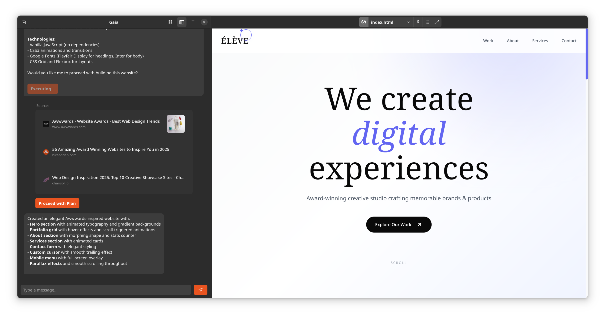
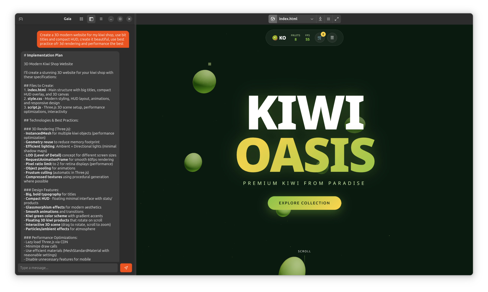
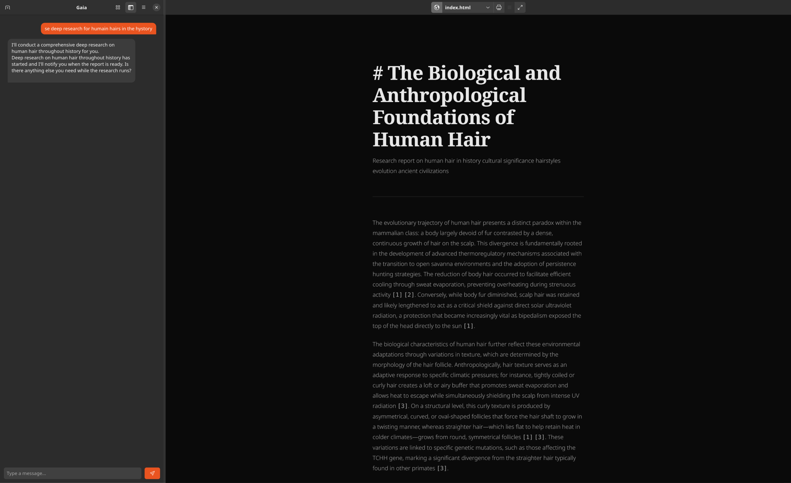

# Gaia - GNOME AI Assistant

**Your personal AI companion, built for GNOME.**

Gaia is a fast, beautiful, and private AI assistant that lives on your Linux desktop. It integrates seamlessly with your system, offering a native experience powered by local LLMs or top-tier cloud models. This isn't just a chat window—it's an agent capable of performing real work on your computer.

<div align="center">
  
  <br>
  <em>Clean, native GNOME interface</em>
  <br><br>
  
  <br>
  <em>Rich chat with markdown, code blocks, and inline artifacts</em>
  <br><br>
  
  <br>
  <em>Powerful tools and artifacts panel</em>
</div>

## ✨ Key Features

### 🎙️ Voice Mode: Your Hands-Free Companion
Experience a completely new way to interact with your computer. With **Voice Mode**, Gaia transforms into a distraction-free, audio-first assistant.
*   **Always Listening, Always Private**: Utilizing **Vosk** speech recognition, Gaia listens for your commands entirely offline. No audio is ever sent to the cloud, ensuring your privacy is never compromised.
*   **Natural Conversation**: Gaia speaks back to you using **Piper TTS**, providing a fluid, natural voice that feels like chatting with a friend rather than a robot.
*   **Distraction-Free**: When activated, the main window disappears, letting you focus on your work. Just say **"Hey Gaia"** to wake it up.
*   **Seamless Integration**: Need to see the text? Deactivate Voice Mode, and you'll find a complete transcript of your voice conversation waiting for you in the chat history.

### 🕵️ Deep Research Agent
Go beyond simple web searches. Gaia's **Deep Research** agent is an autonomous investigator capable of tackling complex topics.
*   **Autonomous Investigation**: Give Gaia a broad topic, and it will formulate a research plan, execute multiple targeted searches, read through dozens of websites, and synthesize the information.
*   **Professional Reports**: The result isn't just a summary—it's a comprehensive report complete with citations, inline images from high-quality sources (Unsplash/Pexels), and a structured layout.
*   **PDF Export**: Need to share your findings? You can download the entire research report as a polished, professionally formatted PDF file (`report.pdf`) with a single click, prioritizing the pre-generated file if available.

### 🌐 Web & App Builder
Turn your ideas into reality without leaving the chat.
*   **Instant Web Previews**: Ask Gaia to build a website, a calculator, or a simple game. It will write the code (HTML/CSS/JS) and instantly render a live preview of the application right in the side panel.
*   **Iterative Design**: Not quite right? Just talk to Gaia to make changes. "Make the button blue," "Add a dark mode"—Gaia updates the preview in real-time.
*   **Console Debugging**: Includes a smart `web_console` tool that silently captures browser errors, allowing the AI to self-correct and fix buggy code without you needing to play developer.

### 🖥️ Deep Desktop Integration
Gaia isn't just an app; it's part of your system. It comes with a suite of **GNOME Tools** to control your environment:
*   **Radio Tuner**: Uses the `radio-browser.info` API to search for and play thousands of internet radio stations from around the world.
*   **Audio Control**: Adjust your system volume, mute/unmute speakers, and query current levels using native `pactl` or `amixer` commands.
*   **Calendar**: Full two-way integration with GNOME Calendar. Ask Gaia to "Schedule a meeting next Friday" or "List my events for today," and it will handle the GDBus communication for you.
*   **System Theme**: Switch between Light and Dark mode on the fly.
*   **Wallpapers**: Search for beautiful 4K wallpapers and apply them to your desktop instantly.

### 📁 Advanced File Tools
*   **File Editor**: The AI can perform surgical edits on files using precise search-and-replace, meaning it can maintain large projects without rewriting entire files.
*   **Smart Reader**: It can read local files to understand your codebase or document context before answering questions.

---

## 🚀 Getting Started

### 1. Prerequisites
You need a modern Linux distribution (Fedora/Ubuntu/Arch) with GNOME.

Gaia supports both local and cloud AI models. Choose what works best for you:

*   **Local (Private)**: Install **[Ollama](https://ollama.ai/)** for completely offline usage.
    ```bash
    ollama pull granite4:latest
    ```
*   **Cloud (Powerful)**: Gaia natively integrates with top-tier cloud providers. You can configure your API keys directly in the application settings for:
    *   **Anthropic** (Claude)
    *   **OpenAI** (GPT)
    *   **Google** (Gemini)
    *   **Mistral AI**
    *   **Z.ai** (GLM-4)

### 2. Installation
Gaia relies on standard system libraries.

**Ubuntu / Debian:**
```bash
sudo apt install libgtk-4-dev libadwaita-1-dev python3-dev gobject-introspection libcairo2-dev libpango-1.0-0 libpangoft2-1.0-0
```

**Fedora:**
```bash
sudo dnf install gtk4-devel libadwaita-devel python3-devel gobject-introspection-devel cairo-gobject-devel pango-devel
```

**Arch Linux:**
```bash
sudo pacman -S gtk4 libadwaita python python-gobject cairo pango
```

### 3. Setup Python Environment
Create a virtual environment and install dependencies:
```bash
python3 -m venv .venv
source .venv/bin/activate
pip install -r requirements.txt
```

### 4. Run Gaia
Launch it casually from the terminal:
```bash
./.venv/bin/python3 src/main.py
```

## ⌨️ Pro Tip: Keyboard Shortcut
Bind `Super+Space` to open Gaia instantly!
1.  Go to **Settings** -> **Keyboard** -> **View and Customize Shortcuts** -> **Custom Shortcuts**.
2.  Add a shortcut:
    *   **Command**: `/path/to/gaia/src/main.py` (ensure you use the absolute path to the python interpreter in the venv)

## 📄 License
This project is licensed under the [GNU General Public License v3.0](LICENSE).
