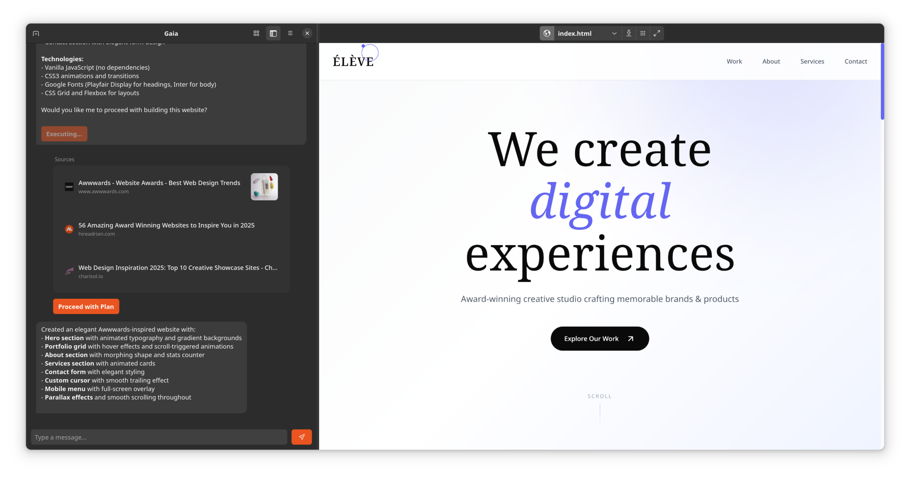
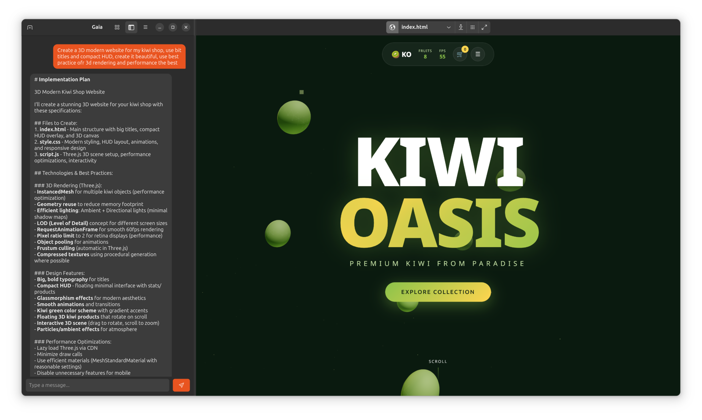
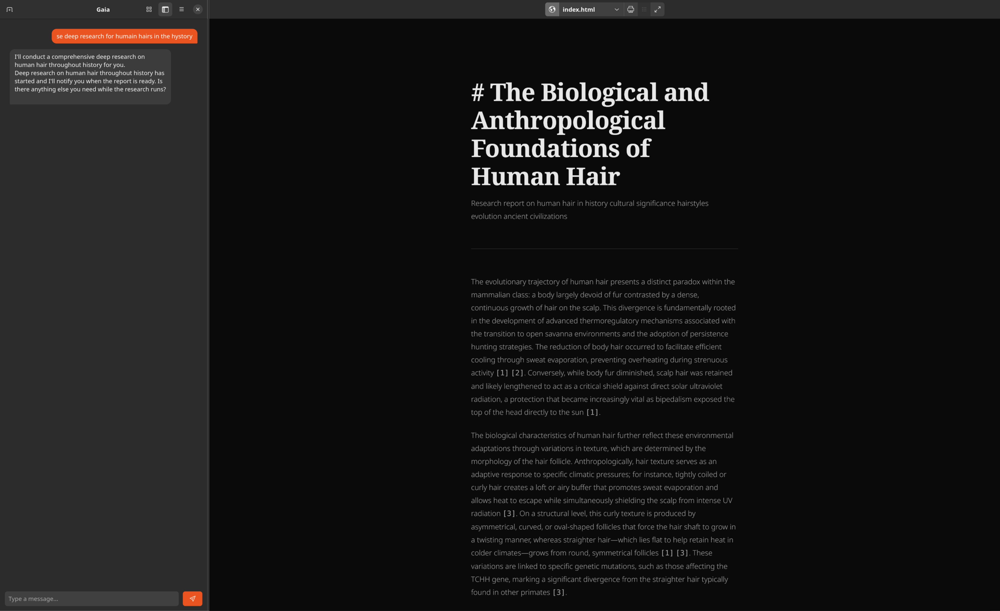

# Gaia - GNOME AI Assistant

**Your personal AI companion, built for GNOME. Now in Rust.**

Gaia is a fast, beautiful, and private AI assistant that lives on your Linux desktop. It integrates seamlessly with your system, offering a native experience powered by local LLMs or top-tier cloud models. This isn't just a chat window—it's an agent capable of performing real work on your computer.

This is the **Rust rewrite** (v0.5.0), maintaining the exact same GNOME interface as the Python original while providing better performance, memory safety, and native compilation.

<div align="center">
  
  <br>
  <em>Clean, native GNOME interface</em>
  <br><br>
  
  <br>
  <em>Rich chat with markdown, code blocks, and inline artifacts</em>
  <br><br>
  
  <br>
  <em>Powerful tools and artifacts panel</em>
</div>

## ✨ Key Features

### Voice Mode: Your Hands-Free Companion
Experience a completely new way to interact with your computer. With **Voice Mode**, Gaia transforms into a distraction-free, audio-first assistant.
- **Always Listening, Always Private**: Utilizing **Vosk** speech recognition, Gaia listens for your commands entirely offline.
- **Natural Conversation**: Gaia speaks back using **Piper TTS**, providing a fluid, natural voice.
- **Distraction-Free**: When activated, the main window disappears. Just say **"Hey Gaia"** to wake it up.
- **Seamless Integration**: Deactivate Voice Mode and find a complete transcript waiting in chat history.

### Deep Research Agent
Gaia's **Deep Research** agent is an autonomous investigator capable of tackling complex topics.
- **Autonomous Investigation**: Formulates a research plan, executes targeted searches, reads dozens of websites, and synthesizes information.
- **Professional Reports**: Comprehensive reports with citations, inline images, and structured layout.
- **PDF Export**: Download research reports as polished PDF files.

### Web & App Builder
Turn your ideas into reality without leaving the chat.
- **Instant Web Previews**: Build websites (HTML/CSS/JS) and see live previews in the side panel.
- **Iterative Design**: Make changes conversationally — "Make the button blue", "Add dark mode".
- **Console Debugging**: Smart `web_console` tool captures browser errors for AI self-correction.

### Deep Desktop Integration
- **Radio Tuner**: Search and play thousands of internet radio stations.
- **Audio Control**: Adjust system volume, mute/unmute via native `pactl`.
- **Calendar**: Full GNOME Calendar integration via GDBus.
- **System Theme**: Toggle Light/Dark mode.
- **Wallpapers**: Search and apply 4K wallpapers instantly.

### Advanced File Tools
- **File Editor**: Surgical search-and-replace edits on files.
- **Smart Reader**: Read local files to understand codebase context.

---

## Tech Stack

| Layer | Technology |
|-------|-----------|
| Language | Rust (2021 edition) |
| UI Toolkit | GTK4 + Libadwaita |
| Code Highlighting | GtkSourceView 5 |
| Web Preview | WebKitGTK 6.0 |
| Async Runtime | Tokio |
| HTTP Client | Reqwest |
| AI Providers | ollama-rs, async-openai, reqwest |
| Config | serde_json (~/.gaia/config.json) |

---

## Getting Started

### 1. Prerequisites
A modern Linux distribution (Fedora/Ubuntu/Arch) with GNOME. Also works on macOS with GTK4 installed.

Gaia supports both local and cloud AI models:

- **Local (Private)**: Install **[Ollama](https://ollama.ai/)** for offline usage.
  ```bash
  ollama pull granite4:latest
  ```
- **Cloud (Powerful)**: Configure API keys in Settings for Anthropic, OpenAI, Google Gemini, Mistral, or Z.ai.

### 2. Install Dependencies

**Ubuntu / Debian:**
```bash
sudo apt install libgtk-4-dev libadwaita-1-dev libwebkitgtk-6.0-dev libgtksourceview-5-dev cargo rustc
```

**Fedora:**
```bash
sudo dnf install gtk4-devel libadwaita-devel webkitgtk6.0-devel gtksourceview5-devel cargo rust
```

**Arch Linux:**
```bash
sudo pacman -S gtk4 libadwaita webkitgtk-6.0 gtksourceview5 cargo rust
```

### 3. Build & Run

```bash
# Clone the repo
git clone https://github.com/askscience/gaia.git
cd gaia
git checkout rust

# Build (release)
cargo build --release

# Run
./target/release/gaia
```

Or use the quick install script:

```bash
curl -fsSL https://raw.githubusercontent.com/askscience/gaia/rust/install.sh | bash
```

### 4. Development

```bash
# Debug build with hot reload
cargo run

# Watch for changes
cargo watch -x run

# Run tests
cargo test
```

---

## Keyboard Shortcut
Bind `Super+Space` to open Gaia instantly:
1. Go to **Settings** → **Keyboard** → **Custom Shortcuts**
2. Command: `/path/to/gaia/target/release/gaia`

---

## License
Licensed under the [GNU General Public License v3.0](LICENSE).
